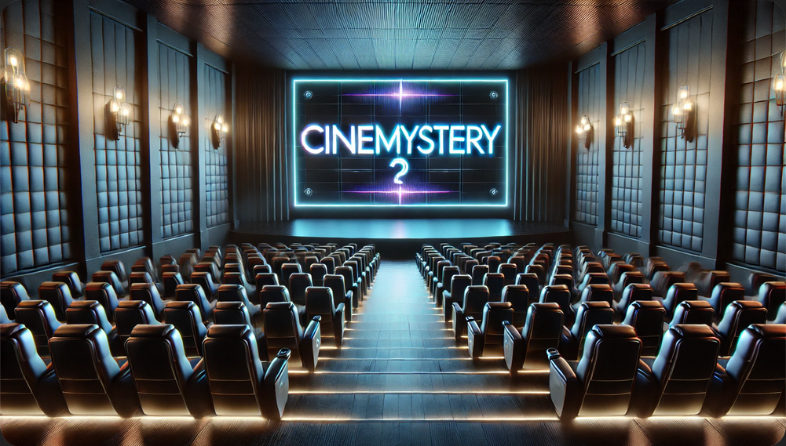

# CineMystery 🎬



Cinemystery is a movie guessing game that challenges your film knowledge through unique and often unconventional descriptions. Each clue presents a brief, quirky summary of a movie, and your goal is to identify the film it refers to. With a mix of well-known classics and hidden gems, Cinemystery offers a fun and diverse way to test your familiarity with a wide range of movies.


## Getting Started

### Clone the repository:

```bash
git clone https://github.com/SanketJadhav7d3/CineMystery.git
cd cinemystery
```

### Install dependencies:

You can use one of the following commands depending on your preferred package manager:

```bash
npm install
# or
yarn install
# or
pnpm install
# or
bun install
```

### Set up Gemini API Key:

To access the Gemini API, you'll need to add your API key as an environment variable.

```makefile
GEMINI_API_KEY=your_api_key_here
```

### Run the development server:

```bash
npm run dev
# or
yarn dev
# or
pnpm dev
# or
bun dev
```

Open [http://localhost:3000](http://localhost:3000) with your browser to see the result.

# UI


